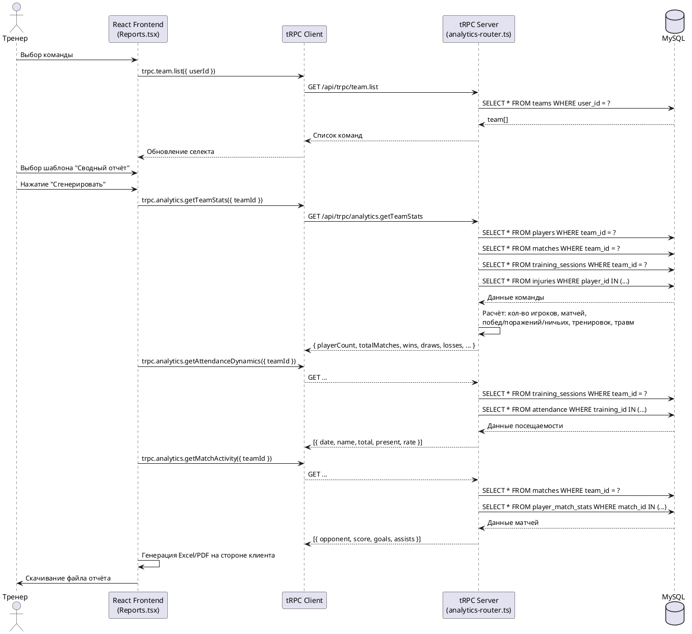
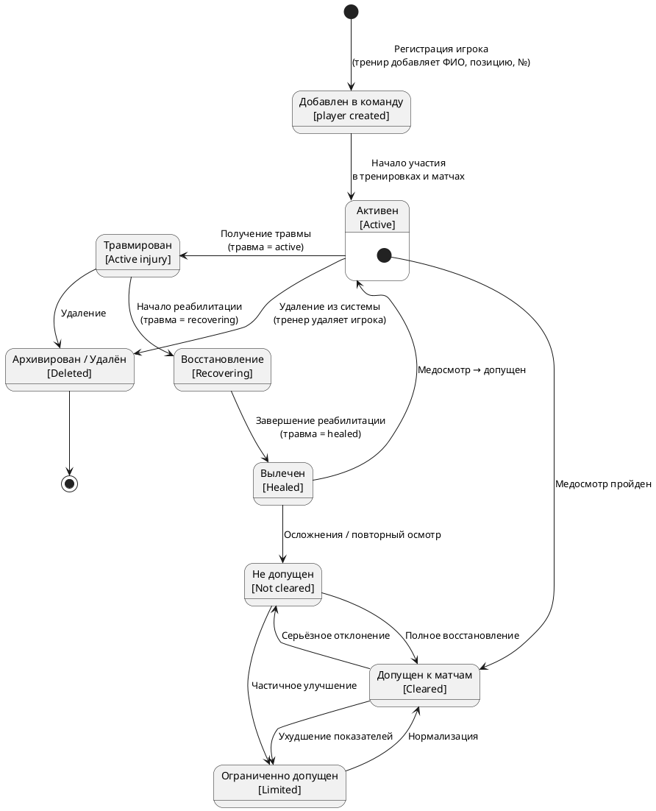

# 3.1.2 Диаграммы последовательности

## Сценарий: Ввод медицинских показателей игрока

```plantuml
@startuml
actor "Тренер/Врач" as User
participant "React Frontend\n(Medical.tsx)" as UI
participant "tRPC Client" as RPC
participant "tRPC Server\n(medical-router.ts)" as Server
database "MySQL\n(health_metrics)" as DB

User -> UI: Выбор команды и игрока
UI -> RPC: trpc.medical.listPlayersWithStatus({ teamId })
RPC -> Server: GET /api/trpc/medical.listPlayersWithStatus
Server -> DB: SELECT * FROM players WHERE team_id = ?
Server -> DB: SELECT * FROM medical_records WHERE player_id = ?
Server -> DB: SELECT * FROM injuries WHERE player_id = ?
Server -> DB: SELECT * FROM health_metrics WHERE player_id = ?
DB --> Server: Данные игрока + медкарта + травмы + метрики
Server --> RPC: { player, latestRecord, activeInjuries, latestHealth }
RPC --> UI: Обновление списка медкарт

User -> UI: Нажатие "Добавить показатели"
UI -> User: Открытие диалогового окна
User -> UI: Заполнение формы (вес, пульс, дистанция Купера и т.д.)
User -> UI: Нажатие "Сохранить"

UI -> RPC: trpc.medical.createHealthMetric.mutate({
  playerId, weight, restingHr,
  cooperDistance, bloodPressureSys,
  bloodPressureDia, recordedAt
})
RPC -> Server: POST /api/trpc/medical.createHealthMetric
Server -> Server: Валидация Zod
Server -> DB: INSERT INTO health_metrics (...)
DB --> Server: { insertId }
Server --> RPC: { id: number }
RPC --> UI: Успех

UI -> UI: invalidateQueries('medical.listHealthMetrics')
UI -> RPC: trpc.medical.listHealthMetrics({ playerId })
RPC -> Server: GET /api/trpc/medical.listHealthMetrics
Server -> DB: SELECT * FROM health_metrics WHERE player_id = ? ORDER BY recorded_at
DB --> Server: Обновлённый список
Server --> RPC: HealthMetric[]
RPC --> UI: Обновление графика и таблицы
UI -> User: Тостер "Показатели добавлены"
@enduml
```

## Сценарий: Формирование отчёта (сводная статистика команды)



# 3.1.3 Диаграмма состояний (жизненный цикл игрока в системе)


